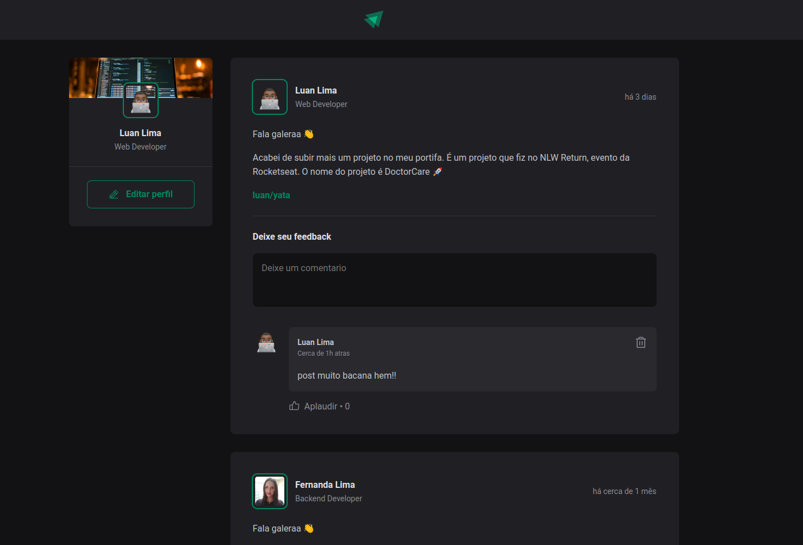

<h1 align="center">
 Ignite Feed - Micro blog
</h1>

<p align="center">
  

  <a href="https://www.linkedin.com/in/luanyata/">
    
  </a>

  

  <a href="https://github.com/luanyata/Ignite-Feed/stargazers">
    
  </a>
</p>

---

## Sobre:

Plataforma para publicacao de micro posts.

---

### Tecnologias:
* React
* Typescript
* Date fns
* Phosphor React
* Vite
---
### Commit:
* Commitizen
* CZ Emojin

---

### Instalação Dependencias:

```bash
yarn
```
---

### Executar Aplicação em Desenvolvimento:

```bash
yarn dev
```

### Executar Aplicação:

```bash
yarn start
```
---
### Licença
MIT